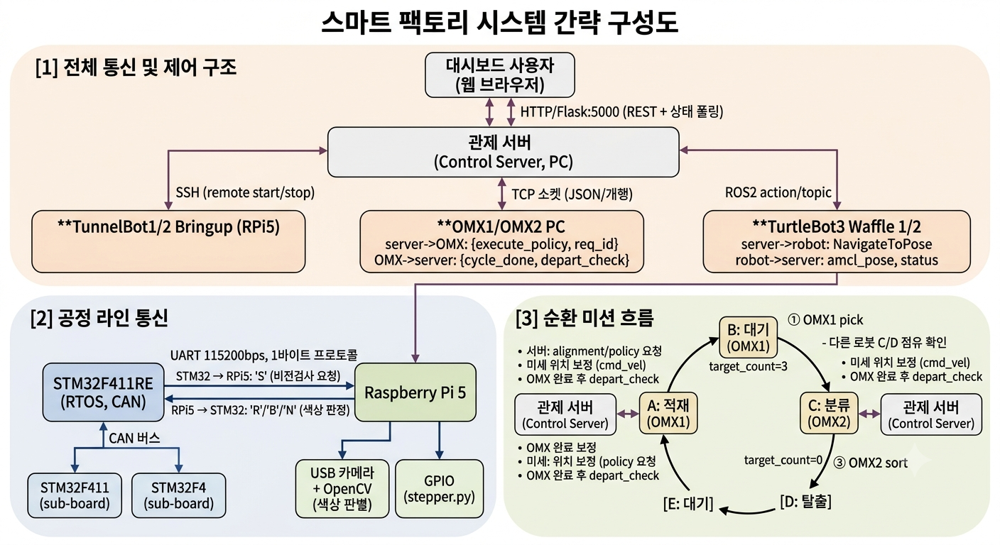

# 알약 자동 패키징 시스템 (Auto Pill Packaging Factory)

> ROS2 기반 알약 자동 이송·분류 시스템. STM32 공정 라인에서 완제품이 나오면 매니퓰레이터가 이를 집어 이동 로봇에 적재하고, 로봇이 지정된 위치로 이동해 색상별로 분류하는 과정을 반복 수행합니다.

<!-- 필요 시 상단에 데모 GIF/스크린샷 배치

-->

## 목차

- [프로젝트 소개](#프로젝트-소개)
- [주요 기능](#주요-기능)
- [시스템 구성](#시스템-구성)
- [동작 흐름](#동작-흐름)
- [하드웨어](#하드웨어)
- [소프트웨어 / 개발 환경](#소프트웨어--개발-환경)
- [레포지토리 구조](#레포지토리-구조)
- [설치 및 실행](#설치-및-실행)
- [팀 구성](#팀-구성)
- [트러블슈팅 / 진행 기록](#트러블슈팅--진행-기록)
- [라이선스](#라이선스)

## 프로젝트 소개

- **프로젝트명**: (예: AP / 알약 자동 패키징 공장)
- **한 줄 소개**: [TODO: 프로젝트를 한 문장으로 요약]
- **배경 / 목적**: [TODO: 왜 이 프로젝트를 시작했는지, 해결하려는 문제]
- **개발 기간**: [TODO: YYYY.MM ~ YYYY.MM]

## 주요 기능

- [ ] STM32 기반 알약 공정 라인 제어 (충진/뚜껑 압착 등)
- [ ] OMX 매니퓰레이터를 이용한 완제품 픽업 및 이동 로봇 적재
- [ ] TurtleBot3 Waffle의 자율주행 기반 지정 위치 이동
- [ ] OpenCV 기반 빨강/파랑 약통 색상 분류
- [ ] 분류 후 적재 위치 복귀 및 공정 반복(순환) 동작
- [ ] 관제 대시보드를 통한 로봇 선택 투입 / 중단·재개 / 실시간 위치 모니터링 (`docs/images/dashboard.png` 참고)

> [TODO: 실제 구현된 기능만 남기고 체크, 스크린샷/GIF 추가]

## 시스템 구성



### 1) 전체 통신 구조

```
┌─────────────────┐   HTTP/Flask :5000 (REST + 상태 폴링)
│  대시보드 사용자   │ ─────────────────────────────────────────┐
│  (웹 브라우저)     │  · 미션 시작 / 일시정지·재개                 │
└─────────────────┘  · 로봇 1·2 투입 선택, A/C 수동 강제출발 신호   │
                      · 실시간 위치·배터리·진행 로그 조회            │
                                                                  ▼
┌───────────────────────────────────────────────────────────────────────┐
│                  관제 서버 (PC, ROS2 + Flask, server_pkg)               │
│   control_server / modi_bridge(ActionProxy·PoseTracker·OdomTracker) /  │
│   modi_mission_manager(A→B→C→D→E 순환 로직) / stats_db(SQLite 로그)     │
└───────┬───────────────────────────┬──────────────────────┬────────────┘
        │ SSH(paramiko)             │ TCP 소켓, JSON+개행     │ ROS2 action/topic
        │ 원격 기동·종료             │ 1줄(OMX 정책/검사 통신)  │ (로봇별 도메인 브릿지)
        ▼                           ▼                        ▼
┌────────────────────┐   ┌───────────────────────┐   ┌─────────────────────────┐
│ TurtleBot1/2 bringup│   │  OMX1 PC (A 지점)       │   │  TurtleBot3 Waffle 1/2   │
│ Raspberry Pi5       │   │   role: loading(적재)   │   │  (Nav2 + amcl + odom)    │
│ stepper.py(GPIO)    │   │  OMX2 PC (C 지점)       │   └────────────┬─────────────┘
│ → 관제서버가 SSH로   │   │   role: sorting(분류)   │                │
│   원격 실행/종료      │   └───────────┬─────────────┘                │
└────────────────────┘               │                              │
         ┌────────────────────────────┴───────────┐   ┌──────────────┴─────────────┐
         │ server → OMX                            │   │ server → robot              │
         │  execute_policy {policy_name, req_id}   │   │  NavigateToPose goal(x,y,θ) │
         │  check_departure {wp, req_id}           │   │  cmd_vel(TwistStamped)      │
         │  check_alignment {wp, req_id}           │   │   (미세 위치·각도 보정)      │
         │ OMX → server                            │   │ robot → server               │
         │  ack {accepted, reason}                 │   │  amcl_pose(x, y, yaw)       │
         │  cycle_done {policy_name, success}      │   │  odom(Odometry)             │
         │  depart_check {depart_ok,               │   │  battery_state(%)           │
         │    counts:{red,blue,total}, tray_found} │   │  goal 진행/성공 상태          │
         │  alignment {fwd_cm, lat_cm, yaw_deg,    │   └─────────────────────────────┘
         │    aligned, tray_found}                 │
         └──────────────────────────────────────────┘
```

### 2) 공정 라인 (STM32 ↔ Raspberry Pi 5)

```
┌────────────────┐   UART 115200bps, 1바이트 프로토콜   ┌──────────────────────────┐
│  STM32F411RE   │◄────────────────────────────────────►│  Raspberry Pi 5           │
│  (FreeRTOS,CAN)│   STM32 → RPi5 : 'S'  (비전검사 요청) │   · USB 카메라 + OpenCV    │
│  충진/압착 등    │   RPi5 → STM32 : 'R' / 'B' / 'N'     │     (HSV 기반 적/청 캡 판별,│
│  공정 액추에이터/│      (색상 판정 결과 1바이트)          │      실패 시 'N')          │
│  센서 제어       │                                      │   · GPIO 스텝모터 제어      │
└───────┬────────┘                                      │     (stepper.py, 관제서버  │
        │ CAN 버스                                        │     SSH로 원격 기동/종료)   │
        ▼                                                └──────────────────────────┘
(STM32 서브보드 1st/2nd/3rd_board 등이 CAN으로 상호 통신)
   [TODO: 보드별 역할 분담 정리]
```

> TOPST D3G는 현재 코드베이스(`server/`, `raspi/`, `omx/`)에서 연동 지점이 확인되지 않았습니다. [TODO: 실제 역할과 통신 방식 추가]

### 3) 순환 미션 (TurtleBot 1대 기준, `waypoints.yaml` 근거)

```
   ┌───────────────────────────────── 순환 루프 ─────────────────────────────────┐
   ▼                                                                            │
[A: 적재] ──①OMX1 pick──▶ [B: 대기] ──②C/D 점유 확인──▶ [C: 분류] ──③OMX2 sort──▶ [D: 탈출] ──▶ [E: 대기] ─┘
 depart_target_count=3                                depart_target_count=0
 (트레이 3개 채워지면 자동 출발)                          (트레이가 비면 자동 출발)
```

- ①③ 각 지점 도착 시: 서버가 OMX에 `check_alignment` 요청 → wrist 카메라로 트레이 오프셋(fwd/lat/yaw) 측정 → 로봇이 `cmd_vel`로 미세 보정(최대 5회 반복) → 서버가 `execute_policy` 요청 → OMX 완료(`cycle_done`) 후 `check_departure`로 트레이 상태 촬영·판정 → 조건 미충족 시 사이클 반복, 조건 충족(또는 대시보드 수동 해제) 시 다음 지점으로 출발.
- B 지점에서는 C/D가 다른 로봇에 점유돼 있으면 대기(충돌 방지).

## 동작 흐름

1. **공정 진행**: STM32(FreeRTOS, CAN 통신)가 알약 충진·포장 공정을 진행하며, 라즈베리파이 카메라에 비전검사를 요청(UART `'S'`)하고 판정 결과(`'R'`/`'B'`/`'N'`)를 받는다.
2. **픽업 및 적재**: A 지점에서 OMX1이 완제품을 집어 대기 중인 TurtleBot3 Waffle에 적재한다(트레이 3개 채워지면 자동 출발).
3. **이동**: TurtleBot3가 Nav2 기반으로 B(점유 대기)를 거쳐 C(분류 구역)로 자율주행한다.
4. **분류**: C 지점에서 OMX2가 빨강/파랑 약통을 분류하고, 카메라로 트레이가 비었는지 확인되면 출발한다.
5. **복귀 및 반복**: D(탈출) → E(대기)를 거쳐 다시 A(적재 위치)로 복귀하고, 1~5 과정을 반복한다.

> [TODO: 사이클 타임, 장애물 회피 실패 시 처리 등 세부 운영 정책 추가]

## 하드웨어

| 구성 요소 | 역할 | 비고 |
| --- | --- | --- |
| STM32F411RE | 공정 라인(액추에이터/센서) 제어, FreeRTOS 기반, CAN 통신 | `stm32/` (1st/2nd/3rd_board 등 다중 보드) |
| ROBOTIS OMX ×2 | OMX1: A 지점 픽업(loading) / OMX2: C 지점 색상 분류(sorting) | `omx/`, front·wrist 카메라 각 1대 |
| TurtleBot3 Waffle ×2 | 알약 적재 및 A→B→C→D→E 구역 순환 이송 | Nav2 + amcl + odom |
| Raspberry Pi 5 | STM32 공정 라인 비전검사(UART+OpenCV) 및 GPIO 스텝모터 제어 | `raspi/`, 관제서버가 SSH로 원격 기동 |
| TOPST D3G | [TODO: 역할 및 연동 방식 확인 필요] | |
| 관제 PC/서버 | 대시보드(Flask), 미션 매니저, OMX/로봇 통신 허브, 공정 로그(SQLite) | `server/` 참고 |

## 소프트웨어 / 개발 환경

- OS: Ubuntu 24.04
- 미들웨어: ROS2 Jazzy
- 언어: [TODO: Python / C++ 버전]
- 비전: OpenCV [TODO: 버전]
- 통신: [TODO: CAN, UART, ROS2 topic/service/action 등 정리]
- 기타 라이브러리/툴: [TODO]

## 레포지토리 구조

```
autofactory-ros2/
├── docs/          # 이미지, 일일 진행 기록(progress), 발표자료
├── omx/           # OMX 매니퓰레이터 제어/정렬/캘리브레이션 스크립트
├── raspi/         # Raspberry Pi ↔ STM32 통신 코드 및 배선 문서
├── server/        # 관제 서버(ROS2 패키지: server_pkg) - 대시보드, 미션 매니저
├── stm32/         # STM32 펌웨어 (공정 라인 제어)
└── turtlebot/     # TurtleBot3 Waffle 주행/미션 관련 코드
```

> [TODO: 폴더가 추가/변경되면 함께 갱신. 하위 README(`omx/README.md`, `raspi/README.md`, `server/README.md`, `stm32/README.md`, `turtlebot/README.md`)에 세부 내용 작성]

## 설치 및 실행

- **ROS2 스택 (관제서버 + OMX + TurtleBot + 라즈베리파이)**: 관제서버가 나머지를 SSH/TCP/ROS2로 오케스트레이션하는 구조라, 빌드·실행 순서·설정 파일·트러블슈팅을 한 곳에 정리해뒀습니다 → [`server/README.md`](server/README.md)
- **STM32 (임베디드 펌웨어)**: 별도 툴체인(STM32CubeIDE)으로 빌드/플래싱합니다 → [`stm32/`](stm32/) [TODO: `stm32/README.md` 작성]

## 팀 구성

| 이름 | 역할 |
| --- | --- |
| [TODO] | [TODO] |
| [TODO] | [TODO] |
| [TODO] | [TODO] |
| [TODO] | [TODO] |
| [TODO] | [TODO] |
| [TODO] | [TODO] |
| [TODO] | [TODO] |

## 트러블슈팅 / 진행 기록

- ROS2 스택(관제서버/OMX/TurtleBot) 트러블슈팅: [`server/README.md`](server/README.md#트러블슈팅)
- 일일 진행 기록(그날그날의 이슈·해결 기록): [`docs/progress/`](docs/progress/)

## 라이선스

이 프로젝트는 [LICENSE](LICENSE)를 따릅니다.
