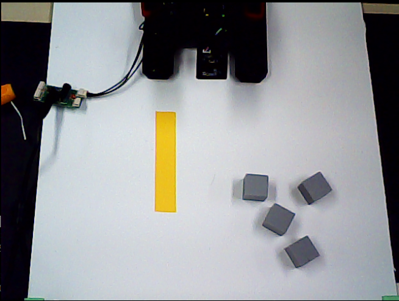
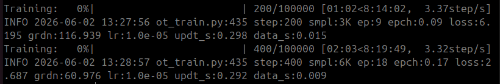
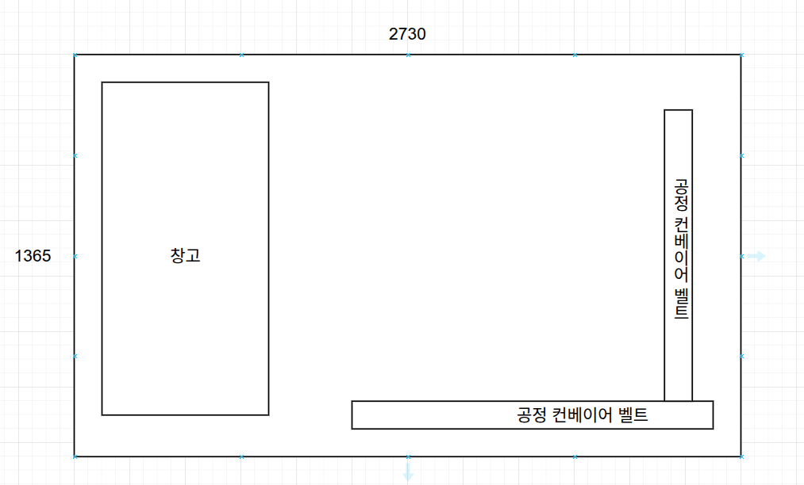

# 📋 일일 업무 일지

| 항목 | 내용 |
| --- | --- |
| 날짜 | 2026-06-02 (화) |
| 팀명 / 프로젝트명 | AP / 알약 자동 패키징 공장 |
| 프로젝트 개요 | • ROS2 기반 자동 이송 및 분류<br>• OpenCV 활용 불량품 검출<br>• STM32F411RE(RTOS, CAN 통신) 기반 액추에이터/센서 제어 |

---

## 오늘 한 일

### 1. 모방학습 (IL) 및 로봇 환경 세팅
- TurtleBot3 Waffle 환경 세팅 및 순차제어 테스트
- OMX 모방학습(ACT Policy) 테스트를 위한 모델 학습 진행
  - 조건: 100개 에피소드, 100,000 Steps, Batch Size 16 (소요 시간: 약 8시간 30분)
  - 학습 명령어:
    ```bash
    cd ~/il_ws/src/lerobot && lerobot-train \
      --dataset.repo_id=${HF_USER}/pick \
      --policy.type=act \
      --output_dir=outputs/train/omx_act_policy2 \
      --job_name=act_record-test2 \
      --policy.device=cuda \
      --wandb.enable=false \
      --policy.repo_id=${HF_USER}/omx_act_policy2 \
      --batch_size=16 \
      --save_checkpoint=true \
      --save_freq=10000 \
      --steps=100000
    ```
  - 학습 관련 이미지:
  
    
    

### 2. 테스트 환경 구축 및 공정 구상
- 폼보드 테스트 환경(공장) 구현 및 창고 세팅 완료
  - 테스트 환경 맵 구조:
    
- 약 패키징 공정 프로세스 구체화
  - `컨베이어 벨트 이송` → `빈 통에 알약 투입` → `뚜껑 결합` → `뚜껑 닫기 및 불량품 분류(OpenCV)`
- STM32 공정 구성 및 필요 물품 취합 완료

---

## 내일 할 일

- [ ] OMX 학습 모델 추론 및 검증
  - 물건이 여러 개 쌓여있는 복잡한 환경에서 타겟을 정확히 판별하고 지정된 위치로 이송(Pick & Place)하는지 확인
- [ ] 창고 폼보드 최종 결합 및 물리적 환경 고도화
- [ ] OMX 구역 실제로 설정한 뒤 모방학습 데이터 수집
- [ ] 와플 내부에 커스텀 맵 추가 및 주행
- [ ] 와플끼리 위치 공유 및 관제 서버 동기화

---
