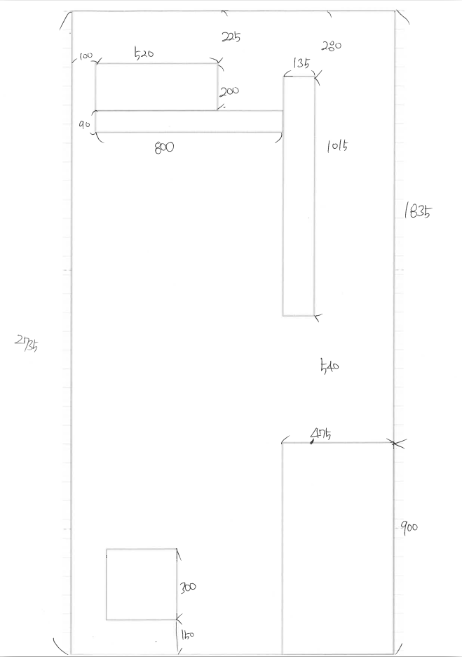
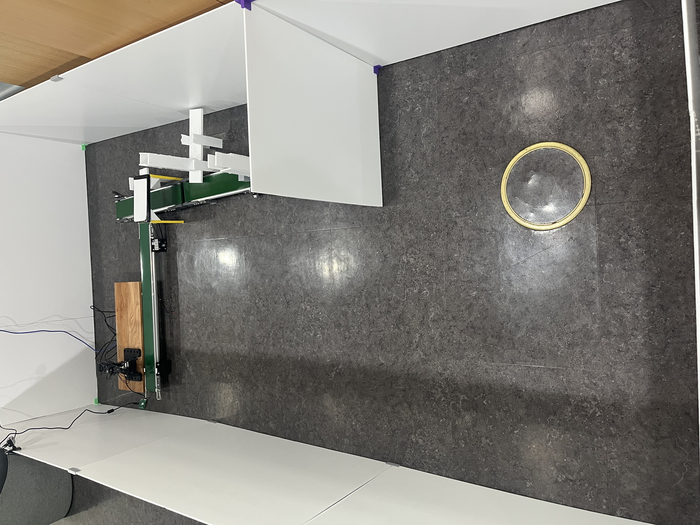
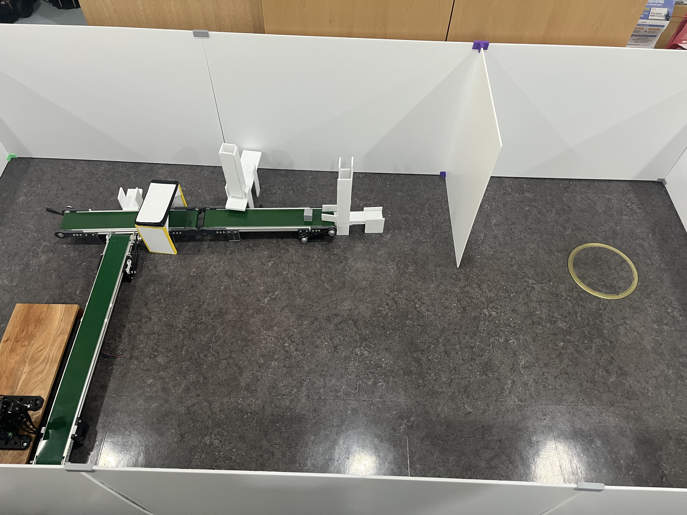

# 📋 일일 업무 일지

| 항목 | 내용 |
| --- | --- |
| 날짜 | 2026-06-04 (목) |
| 팀명 / 프로젝트명 | AP / 알약 자동 패키징 공장 |
| 프로젝트 개요 | • ROS2 기반 자동 이송 및 분류 • OpenCV 활용 불량품 검출 • STM32F411RE(RTOS, CAN 통신) 기반 액추에이터/센서 제어 |

---

## 오늘 한 일

### 1. 공정 환경 및 맵 구성 완료

* 공정 운영을 위한 테스트 맵 설계 및 제작 완료
* 주행 경로 및 작업 구역 배치 확정

#### 맵 구성

#### 맵 측면

#### 맵 정면

---

### 2. ROS2 멀티 로봇 환경 구성

* ROS2 Domain 분리 적용
* Bringup 패키지 수정

  * 로봇 초기 위치 설정 기능 추가
  * Bringup 실행 시 Nav2 자동 실행 기능 추가
* TurtleBot3 Waffle 2대 동시 운영 환경 구축
* 순차 이동 제어 및 관제 시스템 구현 진행 중

---

### 3. STM32 시스템 검증

* STM32 RTOS 동작 테스트
* 센서 인터페이스 테스트
* 통신 기능 테스트

---

### 4. 한화로보틱스 협동로봇팔 학습

* 기본 예제 실행 및 구조 분석
* TCP 통신 방식 학습
* 향후 공정 연동을 위한 제어 방식 검토

---

### 5. 공정 프로토타입 개선

* 공정 프로토타입 구조 수정 및 개선
* 약(알약) 모델링 변경
* 알약 디스펜서 모델링 진행
* OMX 고정 구조 제작 및 위치 조정

---

## 다음 할 일 (06/08)

* [ ] 분류 공정 구성 완료
* [ ] ROS2 자율주행용 맵 완성
* [ ] Waffle 웨이포인트 지정 및 순차 제어 테스트
* [ ] STM32 + 액추에이터 동작 구현
* [ ] Waffle 주행 파라미터 튜닝

---

## 진행 현황 요약

* 공정 환경 및 맵 구성 완료
* ROS2 멀티 로봇 운영 환경 구축 진행 중
* STM32 제어 시스템 검증 완료
* 협동로봇팔 제어 방식 학습 진행
* 공정 프로토타입 및 모델링 개선 진행
