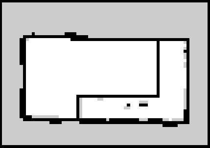

# 📋 일일 업무 일지

| 항목 | 내용 |
| --- | --- |
| 날짜 | 2026-06-09 (화) |
| 팀명 / 프로젝트명 | AP / 알약 자동 패키징 공장 |
| 프로젝트 개요 | • ROS2 기반 자동 이송 및 분류 • OpenCV 활용 불량품 검출 • STM32F411RE(RTOS, CAN 통신) 기반 액추에이터/센서 제어 |

---

## 오늘 한 일 (06/09)

### 1. OMX
- 분류 파트 OMX 및 창고 배치 완료

### 2. Waffle
- ROS2 자율주행용 맵 완성
    
- 와플 구조 변경 완료(라이다 위치 z축 상승)

### 3. STM32
- CAN통신 테스트 (수신 + 송신) -> 일대일 센서 값 통신 완료

### 4. 디자인
- 와플용 창고 완료

---

## 내일 할 일 (06/10)

### 1. OMX
- 적재 모방학습 데이터 수집
- 학습

### 2. Waffle
- 와플 한대 라이다 문제 해결
- Waffle 웨이포인트 지정 및 순차 제어 테스트
- Waffle 주행 파라미터 튜닝(추가)

### 3. STM32
- 액추에이터 동작 구현
- 컨베이어 벨트 작동 테스트
- CAN통신 다대다

### 4. 디자인
- 파란색 약통 출력
- 약 디스펜서 출력