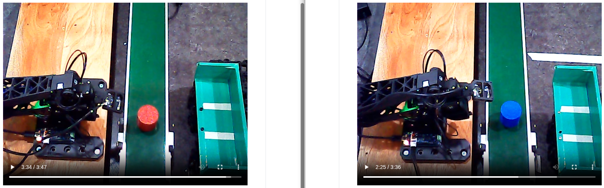

# 📋 일일 업무 일지

| 항목 | 내용 |
| --- | --- |
| 날짜 | 2026-06-12 (금) |
| 팀명 / 프로젝트명 | AP / 알약 자동 패키징 공장 |
| 프로젝트 개요 | • ROS2 기반 자동 이송 및 분류 • OpenCV 활용 불량품 검출 • STM32F411RE(RTOS, CAN 통신) 기반 액추에이터/센서 제어 |

---

## 오늘 한 일(06/12)

### 1. OMX

- 적재 180 에피소드 학습 완료(빨빨빨 90, 파파파 90 / 기존 학습된 가중치에 추가 학습)  
    테스트 완료  
    빨간색, 파란색 섞여있을 때에도 정상 작동 확인(빨간색만)  
    파란색은 집기 동작에 문제 존재, 집기 이후에는 차에 적재되어있는 약통의 색에 상관없이 정상 동작  
- 적재 180 에피소드 한 번에 학습 완료  
    policy.repo_id=${HF_USER}/pick1_policy_test1  
    기존 학습된 가중치에 한 추가 학습이 첫 학습(빨빨빨 90)에 편향되지 않는지 검증하기 위함  
- 적재 100 에피소드 추가 수집 후 학습(총 280 에피소드, 빨빨빨 50, 파파파 50)
    policy.repo_id=${HF_USER}/pick1_policy_test2  
    사이드 캠 촬영 영상에 파란선이 있어 정상 학습 여부 파악 후 정상적으로 동작하지 않는다면 허깅페이스 데이터 셋 레포 수정(이후에 수집한 100개의 에피소드 삭제)  
- 와플 창고 양 옆 높이 5cm -> 2.5cm 변경
    분류 시 OMX가 약통을 집는데 어려움 존재  
    높이를 낮춰 약통이 어느 위치에 있든 잡을 수 있도록 수정  

### 2. Waffle
- 웨이포인트 기준으로 와플 2대 동시 제어 테스트 완료
    웨이포인트의 간격 줄여서 추가  

### 3. STM32
- 실제 환경 배선 후 동작 테스트(1, 2 + 2.5)  
    컨베이어 벨트 위 약통 진행 테스트 완료(중간 지지대 설치)
- 1번 보드  
    약통 투입(액추에이터 동작) 완료  
    컨베이어 작동 제어 완료  
- 2번 보드  
    별도 추가 보드(2.5번 보드)와 유선 통신 완료  
    약 투입 여부 확인(진행 중)  

### 4. 디자인
- 디스펜서 수정(계속)
- 실제 환경에서 테스트
- 발표자료 HTML로 제작(현재 진행상황까지 완료)

---

## 다음 할 일(06/15)

### 1. OMX
- 분류 모방학습 데이터 수집 각 30 에피소드(고정)
    빨파파 90 / 파빨빨 90 에피소드 수집  
    섞어서 우선  

### 2. Waffle
- 와플에 커스텀 맵 최적화 및 관제 시스템 정확히 설정

### 3. STM32
- 3번 보드  
    적외선 센서 추가 설치  
    실제 환경에서의 진행과정 확인  
- 5번 보드(라즈베리파이)  
    OMX용 PC와 TCP 통신  

### 4. 디자인
- 알약 일정 개수로 분배 되는지 확인

---

## 문제 사항

### 1. OMX
- 빨빨빨 90개 에피소드 파파파 90개 에피소드 수집 후 학습
    동일 에피소드 분포를 가졌지만, 파란색 통에 대해 비정상적인 동작 수행
    - 가정 1. 학습의 차이
        빨빨빨 90개의 에피소드 학습 시킨 가중치에 파파파 90개의 에피소드를 추가로 수집하여 학습 -> 빨간색에 대한 편향 발생?  
        -> 180개의 에피소드를 한 번에 학습 시킨 후 테스트 하였지만, 동일한 문제 발생
    - 가정 2. 색 구분 불가능  
        
        초록 배경 + 파란색의 물체가 제대로 인식되지 않는다. -> 뚜껑에 검은색을 칠하여 새로 데이터 수집 후 학습(파란색만)  
        -> 테스트 결과 ...  
    - 가정 3. 데이터 수집 순서의 차이  
        빨간색 수집 시 1 30, 2 30, 3 30 을 수집하였지만 파란색은 1 2 3 ~ 1 2 3 반복해 90개 수집 -> 학습 과정에 차이 발생?  
        -> 테스트 결과 ...  
    - 가정 4. 파란색은 멀쩡한데 둘 사이 편향 발생?
        파란색 데이터만 따로 학습 후 테스트  
        해당 데이터로 파랑색 자체가 제대로 인식되는지 확인 후 가정 2 수행

### 2. Turtlebot
문제 원인 : 사용자가 그림으로 그린 가상의 벽  
-> 가상 벽을 글로벌 코스트맵에만 적용하면 로컬 코스트맵과 불일치가 생겨, 로컬 플래너가 해당 영역을 인식하지 못해 정상적인 경로 계획이 어렵다는 피드백을 받았습니다.
해결 방법 : Keepout filter를 적용해서 로컬 코스트맵에서도 해당 가벽을 벽으로 인식시키도록 설정해야함  
https://docs.nav2.org/tutorials/docs/navigation2_with_keepout_filter.html#tutorial-steps  
해당 공식 문서를 통해서 필터 적용법을 학습 후 적용  

| 원본 | 선만 그었을 때 | 킵아웃 필터 적용 |
| :---: | :---: | :---: |
|  |  |  |
|원본은 로봇이 장애물이 있는지 조차 인식하지 못하는 상태|선만 그었을때는 글로벌 코스트맵에만 적용되어서 경로 계획이 어려움|킵아웃필터를 설정해서 로봇이 정상적으로 장애물로 인식|

